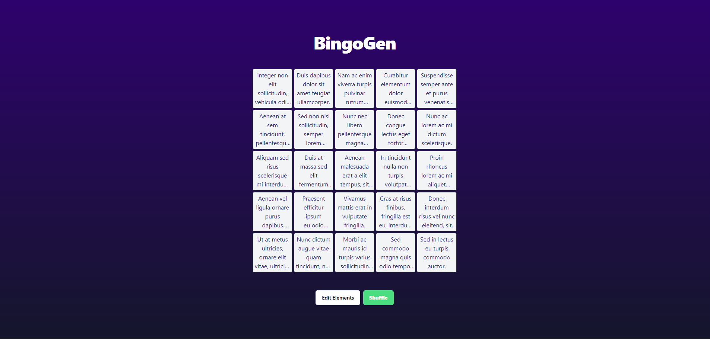
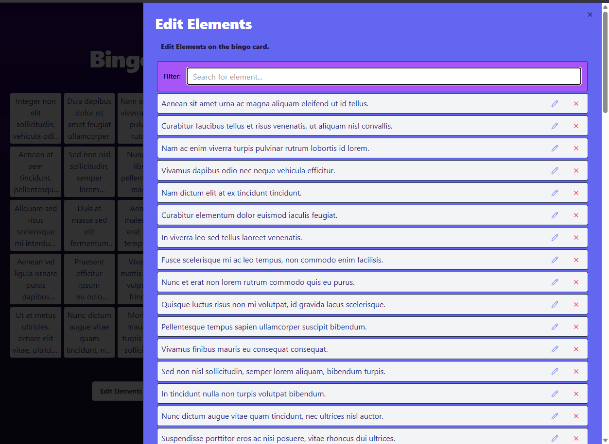

# BingoGen

BingoGen is a bingo generating software. It allows you to set up your own bingo board in populate it with whatever text you wish.

## Getting Started

Clone the project and run `npm run dev` to compile it into you localhost.

## How it works:

The board comes with default generated placeholder text:

- Click a square on the bingo board to select it
- Click on the "Edit Elements" button to open a drawer. Here, you can search for squares and edit them at will.
